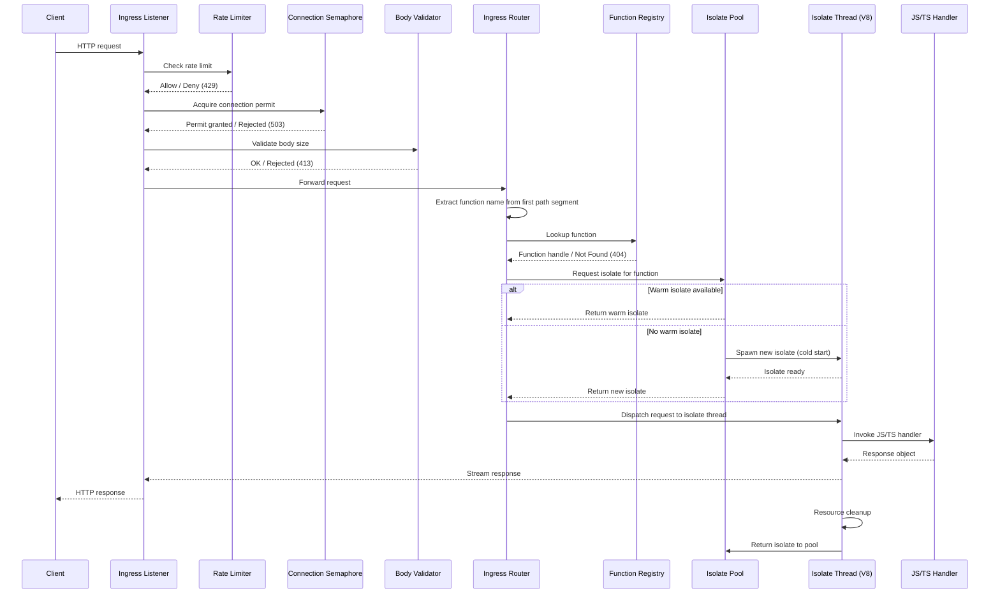

This page traces an HTTP request from the moment it arrives at the ingress listener to the moment the response is delivered back to the client.

## Sequence Diagram

## Step-by-Step Walkthrough

### 1. Connection acceptance

The ingress listener accepts the TCP connection (plain or TLS). If TLS is configured, the `DynamicTlsAcceptor` performs the handshake using the current certificate.

### 2. Rate limiter check

A token-bucket rate limiter keyed by source IP decides whether the request is allowed. If the bucket is exhausted, the server responds immediately with **429 Too Many Requests**.

### 3. Connection semaphore

A bounded semaphore limits the total number of concurrent in-flight requests. If no permit is available, the server responds with **503 Service Unavailable**. This protects downstream isolates from being overwhelmed.

### 4. Body size validation

The `Content-Length` header (or streaming body size) is checked against the configured maximum. Oversized payloads are rejected with **413 Payload Too Large** before any bytes are buffered into memory.

### 5. Function name extraction

The ingress router extracts the function name from the first segment of the request path. For example, a request to `/my-function/api/hello` resolves to the function named `my-function`. The remainder of the path (`/api/hello`) is forwarded to the handler as the local path.

### 6. Registry lookup

The `FunctionRegistry` is consulted using a lock-free `DashMap` read. If no function is registered under the extracted name, the server responds with **404 Not Found**.

### 7. Isolate selection

The isolate pool attempts to hand out a warm (already-initialized) isolate for the target function using LRU eviction policy. If none is available, a cold start is triggered.

### 8. Request dispatch

The request is sent to the isolate's dedicated OS thread via a channel. The V8 event loop on that thread picks up the request and invokes the JavaScript or TypeScript handler.

### 9. Handler execution

User code runs inside the V8 sandbox. It has access to the standard Web APIs (fetch, crypto, TextEncoder, etc.), the Thunder runtime APIs, and the Node.js polyfills registered at boot time.

### 10. Response streaming

The handler returns a `Response` object. The body is streamed back to the client through the Hyper layer without buffering the entire payload in memory.

### 11. Resource cleanup

After the response is fully sent, per-request resources (timers, open fetch connections, pending futures) are cleaned up. The isolate is returned to the pool for reuse.

## Cold Start vs Warm Start

| Aspect | Cold start | Warm start |
|---|---|---|
| Trigger | No idle isolate in the pool for the target function | Idle isolate available in the pool |
| Work performed | Spawn OS thread, create V8 isolate, load ESZIP, run bootstrap.js, compile module graph | Reuse existing thread and isolate, reset per-request state |
| Typical latency | 10--100 ms depending on bundle size | Sub-millisecond dispatch |
| When it happens | First request after deploy, after eviction, or after scale-to-zero | Subsequent requests within the idle timeout |

The pool uses an LRU eviction strategy: when the pool reaches its capacity limit, the least-recently-used isolate is terminated to make room for a new one.

## Timeout Handling

Thunder enforces wall-clock timeouts on handler execution using a **watchdog thread** pattern:

1. When a request is dispatched to an isolate, a watchdog timer is started on a separate thread.
2. If the handler completes before the deadline, the watchdog is cancelled.
3. If the deadline expires, the watchdog thread terminates the V8 isolate by calling `isolate.terminate_execution()`. This causes the handler to throw an unrecoverable exception.
4. The server responds with **504 Gateway Timeout** and the isolate is discarded (not returned to the pool).

This two-thread approach (isolate thread + watchdog thread) ensures that even infinite loops or blocked synchronous code cannot prevent the timeout from firing.
