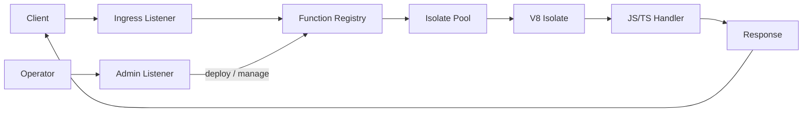

Thunder is a Rust-powered edge runtime built on the Deno stack. It compiles to a single binary (`thunder`) that starts an HTTP server with two listeners: an **ingress listener** for user-facing traffic and an **admin listener** for operator-level management. Both listeners share a common function registry backed by an in-process isolate pool.

## High-Level Architecture

User traffic arrives at the ingress listener, which resolves the target function from the request path, looks it up in the function registry, and dispatches the request to a V8 isolate drawn from the pool. The isolate executes the JavaScript or TypeScript handler and streams the response back to the client.

Operators interact with the admin listener to deploy new functions, update existing ones, or query runtime status. The admin listener writes directly to the function registry, which in turn manages the lifecycle of isolate pools.

## Technology Stack

| Component | Technology | Version |
|---|---|---|
| Language | Rust | 2021 edition |
| Async runtime | Tokio | 1.36+ |
| JavaScript engine | V8 (via deno_core) | deno_core 0.390.0 |
| HTTP server | Hyper | 1.4.1 |
| TLS | Rustls | 0.23.11 |
| Module bundling | ESZIP | 0.109.0 |
| Telemetry | OpenTelemetry | 0.27.0 |

## Key Design Decisions

### Dedicated OS thread per isolate

The V8 `JsRuntime` type is `!Send`, which means it cannot be moved between threads. Thunder respects this constraint by spawning a dedicated OS thread for each isolate. Async I/O still runs on the Tokio runtime, but the V8 event loop is driven on its own thread. This avoids `unsafe` hacks and makes the ownership model explicit.

### In-process function pool

Rather than forking processes or communicating over IPC, Thunder keeps all isolates in the same process and manages them through a pooling layer with LRU eviction. This eliminates serialization overhead on the hot path and allows sub-millisecond dispatch for warm requests.

### ESZIP-based module bundling

Functions are deployed as ESZIP bundles -- a compact, seekable archive format designed by the Deno project. ESZIPs contain pre-resolved module graphs (including source maps and TypeScript type-stripped sources), which means the runtime can skip module resolution at load time and go straight to V8 compilation. This dramatically reduces cold-start latency compared to on-the-fly transpilation.
